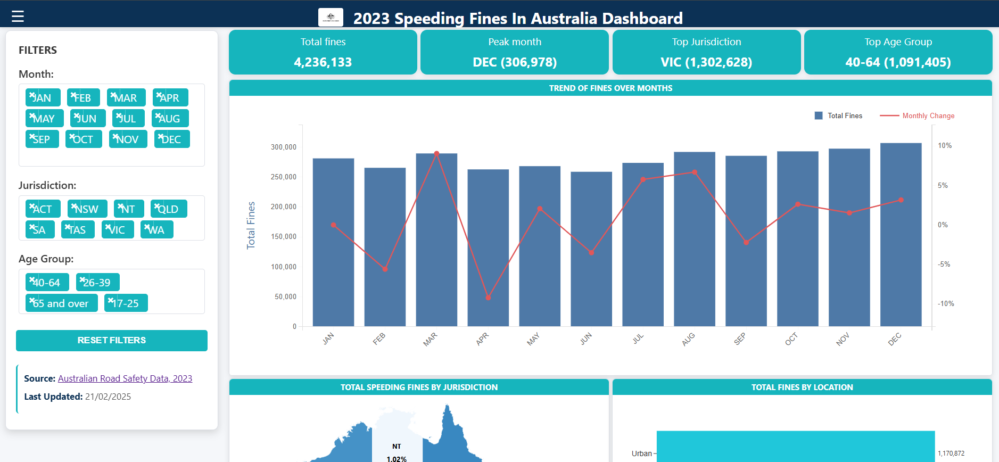

# Speeding-Fines-AU (2023) &nbsp;🚗💨  
[](../../branches) 
[](LICENSE) 
[](https://d3js.org/) 

> **Interactive dashboard revealing how, where and when Australians were fined for speeding in 2023.**

<p align="center">
  
</p>

---

## ✨ What You’ll See

| Insight | Example |
|---------|---------|
| **Monthly Trends** | Identify spikes (e.g. holiday periods). |
| **By Jurisdiction** | Compare VIC, NSW, QLD… |
| **Detection Methods** | Mobile camera vs fixed vs police radar. |
| **Age Groups** | Which demographic racks up the most fines? |
| **Location Type** | Urban vs rural roads, highways, school zones. |

All visuals are interactive — hover for tool-tips, click legends to filter, and watch KPIs update in real time.

## 🛠️ Tech Stack

| Layer | Tools |
|-------|-------|
| Front-End | **HTML · CSS · JavaScript** |
| Visuals  | **D3.js v7** |
| Hosting  | **AWS S3 static site** |
| Data     | Cleaned CSV from [BITRE Road-Safety Enforcement Data (2024)](https://www.bitre.gov.au/publications/2024/road-safety-enforcement-data) |

## 📂 Repo Structure

| File | Description |
|------|-------------|
| `index.html` | Main dashboard interface |
| `css/` | Contains stylesheets for the dashboard |
| `js/` | Contains JavaScript files with D3.js visualizations |
| `data/` | Contains datasets for road safety analysis |
| `assets/` | Contains images and icons used in the dashboard |


## 🚀 Live Demo

Click → **https://my-speeding-fines-dashboard-2025.s3-website-ap-southeast-2.amazonaws.com**  
No build step needed — the site is pure static assets.

## 🧑‍💻 Local Setup (2 mins)

```bash
# Clone this repository
git clone [https://github.com/your-username/DataVisualizationProject.git](https://github.com/your-username/DataVisualizationProject.git)
cd DataVisualizationProject

# Note: Browsers block local file:// XHR requests,
# so you must use a local server to load the CSV data.